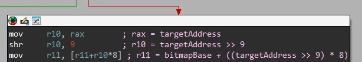
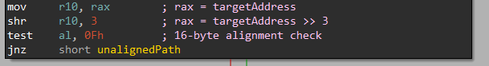
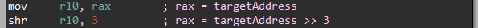
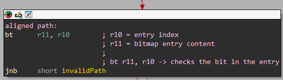
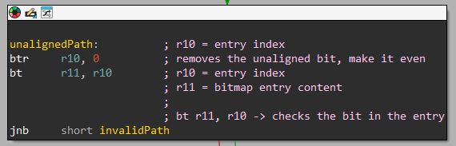
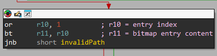

# CFG

This document explains how Windows CFG validates indirect call targets in the kernel, and walks through the manual validation steps for both aligned and unaligned pointers.

There are multiple resources that explain the CFG validation process. The most useful ones I found are:

- [Exploring Control Flow Guard in Windows 10 (Trend Micro)](https://documents.trendmicro.com/assets/wp/exploring-control-flow-guard-in-windows10.pdf)
- [A Measured Approach to CFG Bypass (ACM)](https://dl.acm.org/doi/fullHtml/10.1145/3664476.3670432)

# Manually validate a pointer

We can use the debugger to manually run the validation process for a pointer and verify if it is a CFG-valid pointer.

For example, let's take the address of the kernel function `MmGetSystemRoutineAddress`:

```
lkd> x nt!MmGetSystemRoutineAddress
fffff803`8e0b0d70 nt!MmGetSystemRoutineAddress (MmGetSystemRoutineAddress)
```

We also need the base address of the CFG bitmap:

```
lkd> x nt!guard_icall_bitmap
fffff803`8ea018b8 nt!guard_icall_bitmap = <no type information>

lkd> dq fffff803`8ea018b8 L1
fffff803`8ea018b8  fbff83a0`0c7ba008
```

## Step 1: Find the bitmap entry

The CFG bitmap contains entries and we need to find the one that corresponds to the target address we want to check.

According to the disassembly:



Calculating the address of the corresponding CFG bitmap entry:

```
lkd> ? 0xfbff83a00c7ba008 + ((0xfffff8038e0b0d70 >> 9) * 8)
Evaluate expression: -136888749667272 = ffff8380`1ab3cc38
```

Reading the entry content:

```
lkd> dq ffff8380`1ab3cc38 L1
ffff8380`1ab3cc38  00004000`00000000
```

## Step 2: Checking target address alignment

CFG has different validations for **aligned** and **unaligned** pointers.

According to the disassembly:



Checking the target address alignment:

```
lkd> ? 0xfffff8038e0b0d70 & 0xf
Evaluate expression: 0 = 00000000`00000000
```

As expected for an exported function address, the address is aligned.
So we are in the **aligned validation path**.

## Step 3: Calculate the validation bit index

In the CFG entry we read earlier, we want to check the validation bit.

We already shifted the address right to check alignment, and it is also used as the index for the validation bit in the entry.

According to the previous disassembly:



And later, there is the check of that validation bit in the target address bitmap entry:



When using the `bt` instruction with registers to test if a bit is set, the masking logic follows the formula:

```
Actual Bit = Offset % Register Size
```

So, for a 64-bit register, the bit masked is 6 bits, and the mask is: `0x3F`.

Calculating the index of the validation bit:

```
lkd> ? (0xfffff8038e0b0d70 >> 3) & 0x3f
Evaluate expression: 46 = 00000000`0000002e
```

## Step 4: Check the validation bit

Checking the validation bit in the entry using the calculated index:

```
lkd> ? (0x00004000`00000000 >> 0x2e) & 1
Evaluate expression: 1 = 00000000`00000001
```

And we got `0x1` which indicates the address is **valid**.

# Manual validation for unaligned target address

Steps 1 and 2 are identical to the **aligned** path. The difference begins at Step 3.

Let's say we have an unaligned address. For example, let's take `MmGetSystemRoutineAddress+0x1` which is: `0xfffff8038e0b0d71`.

## Step 1: Find the bitmap entry

Same as the **aligned** path:

```
lkd> ? 0xfbff83a00c7ba008 + ((0xfffff8038e0b0d71 >> 9) * 8)
Evaluate expression: -136888749667272 = ffff8380`1ab3cc38

lkd> dq ffff8380`1ab3cc38 L1
ffff8380`1ab3cc38  00004000`00000000
```

The entry address and the entry content are the same as the previous example.

## Step 2: Checking target address alignment

We already know the address is not aligned:

```
lkd> ? 0xfffff8038e0b0d71 & 0xF
Evaluate expression: 1 = 00000000`00000001
```

The target address is not aligned. We're in the **unaligned** path.

## Step 3: Check the "present" bit

Now things are going to be different from the **aligned** path. We have a few extra steps we need to apply in order to get the correct validation bit index.

We begin with calculating the index the same way we did before:

```
lkd> ? (0xfffff8038e0b0d71 >> 3) & 0x3f
Evaluate expression: 46 = 00000000`0000002e
```

We got the same index as for the **aligned** path. Next we need to validate the index.

According to the disassembly:



First, we need to clear the LSB, then there is a check with the `bt` instruction. Previously we used the mask: `0x3F`, but for now we are going to use `0x3E` (similar to `0x3F` without the LSB bit):

```
lkd> ? 0x2e & 0x3e
Evaluate expression: 46 = 00000000`0000002e
```

We got the new index (in this example, it happens to be the same value).

Now we can check the corresponding entry to see if it is "_present_":

```
lkd> ? (0x00004000`00000000 >> 0x2e) & 1
Evaluate expression: 1 = 00000000`00000001
```

We got `0x1`, meaning we will continue the validation process. If the value was `0x0` we can tell the pointer is **invalid**.

## Step 4: Check the validation bit

According to the disassembly:



We need to set the LSB to `0x1` before checking the entry content again:

```
lkd> ? 0x2e | 1
Evaluate expression: 47 = 00000000`0000002f
```

We got a new index.
Now we can check the validation bit:

```
lkd> ? (0x00004000`00000000 >> 0x2f) & 1
Evaluate expression: 0 = 00000000`00000000
```

As expected, the pointer is **invalid**.
